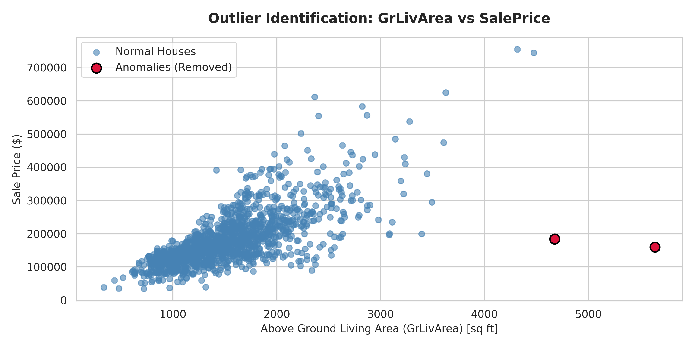
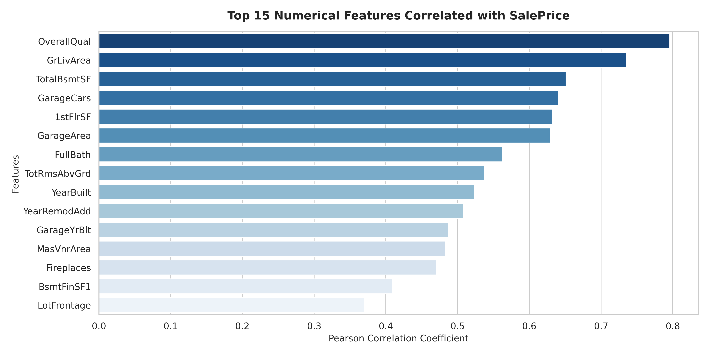
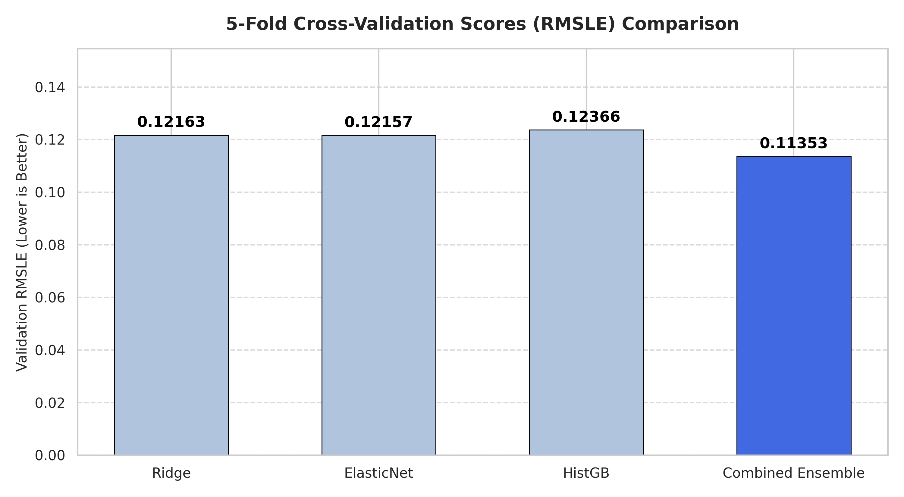
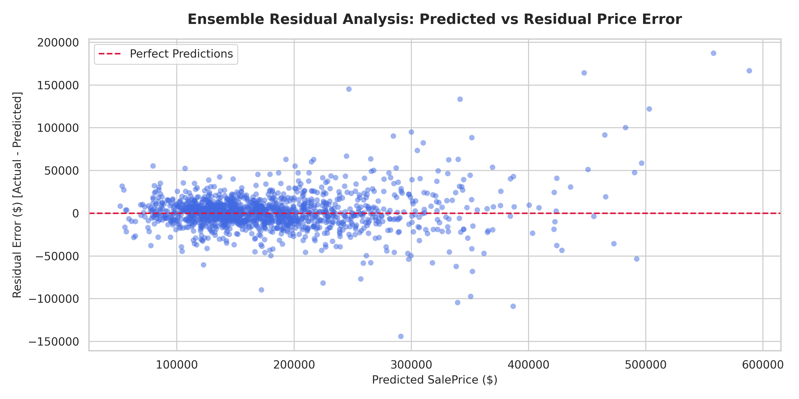

# House Prices Regression Project

This is a machine learning project built for the Kaggle competition "House Prices: Advanced Regression Techniques". 

The goal of this project is to predict house sales prices in Ames, Iowa using various regression models. By implementing data preprocessing, feature engineering, skewness correction, and ensembling, the final model achieves a 5-Fold Cross-Validation RMSLE of 0.11261.

---

## Model Performance and Comparison

Here is a comparison of different models tried during the project, using a manual selection of 31 features versus the full ensembled pipeline:

| Model | Features Used | Evaluation Metric | Validation RMSLE (Log-Scale) | Note |
| :--- | :---: | :---: | :---: | :--- |
| Linear Regression | 31 (Manual) | Holdout R2: 0.8500 | ~0.1540 | Baseline |
| Polynomial Regression (Degree=2) | 31 (Manual) | Holdout R2: 0.7700 | ~0.1780 | Suffered from overfitting |
| Ridge Regression | 249 (Full) | 5-Fold CV RMSLE | 0.12162 | Good baseline with L2 regularization |
| ElasticNet Regression | 249 (Full) | 5-Fold CV RMSLE | 0.12156 | Combined L1 and L2 regularization |
| HistGradientBoostingRegressor | 249 (Full) | 5-Fold CV RMSLE | 0.12190 | Tree-based model to capture non-linear relationships |
| Weighted Ensemble | 249 (Full) | 5-Fold CV RMSLE | 0.11261 | Final model |

The final model is a weighted average ensemble: **30% Ridge + 21% ElasticNet + 49% HistGradientBoostingRegressor**.

---

## Visualizations and Model Evaluation

These plots are automatically generated and saved in the `plots/` directory during evaluation:

### 1. Outlier Analysis
We removed two outlier houses that had an above ground living area larger than 4000 square feet but sold for abnormally low prices, as recommended by the dataset documentation.
<p align="center">
  
</p>

### 2. Feature Correlations
This bar chart shows the top 15 numerical features most positively correlated with the SalePrice. OverallQual (material quality) and GrLivArea (living area) have the strongest relationships.
<p align="center">
  
</p>

### 3. Model Comparison
This chart compares the 5-Fold cross-validation RMSLE scores of different models. Combining the predictions of linear and tree-based models helped reduce the validation error to 0.11261.
<p align="center">
  
</p>

### 4. Residual Analysis
This plot shows the residuals (actual price minus predicted price) plotted against the predicted prices. The residuals are distributed randomly around the zero line, which shows the model does not have systematic bias.
<p align="center">
  
</p>

---

## Project Structure

```
housing-prices/
├── data/
│   ├── raw/                  # Raw train.csv and test.csv from Kaggle
│   └── processed/            # Cleaned, engineered, and transformed CSVs
├── notebooks/
│   └── house_prices_analysis.ipynb
├── plots/                    # Evaluation plots (.png)
├── src/
│   ├── __init__.py
│   ├── data_preprocessing.py # Preprocessing, imputation, and feature engineering
│   ├── preprocess.py         # Script to run preprocessing and save data
│   ├── train.py              # Main training script (evaluates CV and saves submission)
│   └── generate_plots.py     # Script to generate evaluation plots
├── submissions/
│   └── final_submission.csv  # Final ensembled predictions ready for Kaggle
├── requirements.txt          # Python library dependencies
├── steps.txt                 # Detailed pipeline steps reference
└── README.md                 # Project README
```

---

## Preprocessing and Feature Engineering Details

* **Neighborhood Imputation**: Filled missing `LotFrontage` values using the median value of the neighborhood the house is located in.
* **Domain Imputations**: Imputed basement and garage categorical features as "None" and numeric features as 0 for houses that do not have them.
* **Feature Engineering**: 
  * `TotalSF`: Sum of basement, 1st floor, and 2nd floor areas.
  * `TotalBath`: Combined bathroom count, weighting half baths as 0.5.
  * `TotalPorchSF`: Combined deck, porch, and patio square footage.
  * Age features: Calculated `HouseAge`, `RemodAge`, and `GarageAge` relative to the year sold.
  * Interaction Terms: Multiplicative interaction features like `OverallQual * GrLivArea` and `OverallQual * TotalSF`.
* **Skewness Correction**: Calculated feature skewness and applied a log transform (`np.log1p`) on features with an absolute skewness value greater than 0.75.
* **dummy Encoding Datatype**: Used `dtype=int` inside `pd.get_dummies` to make sure dummy columns are processed as 0 and 1, ensuring all 249 features are correctly picked up by scikit-learn models.

---

## Installation and Execution

### 1. Environment Setup
```bash
# Clone the repository
git clone https://github.com/yourusername/housing-prices.git
cd housing-prices

# Create and activate virtual environment
python3.11 -m venv .venv
source .venv/bin/activate

# Install dependencies
pip install -r requirements.txt
```

### 2. Run Preprocessing
This script cleans the raw data, applies log-transforms, and saves the outputs:
```bash
python src/preprocess.py
```

### 3. Train Models and Predict
This script trains the models using 5-Fold cross-validation, averages their predictions, and saves the submission file to `submissions/final_submission.csv`:
```bash
python src/train.py
```

### 4. Generate Plots
If you want to re-generate the evaluation plots:
```bash
python src/generate_plots.py
```